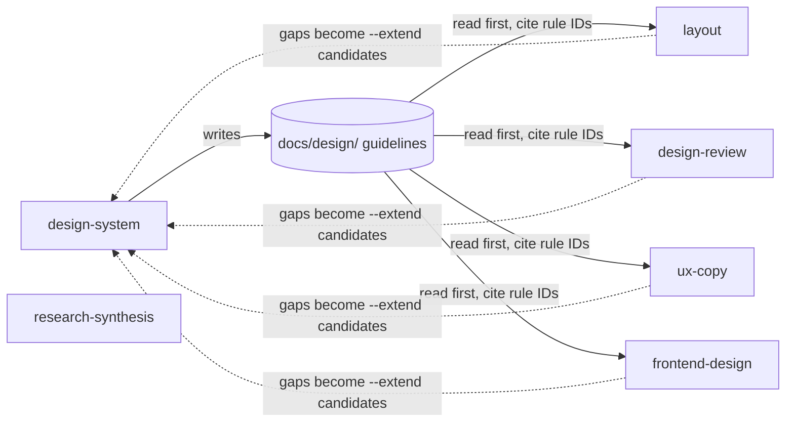

# Components

Each skill is a directory under `skills/`. `SKILL.md` holds the frontmatter (`name`, `description`), the workflow, and the output templates. `references/` holds longer material that the workflow loads only at the step that needs it. Links never cross skill boundaries; a skill names another skill in prose instead.

## Skills and their responsibilities

| Skill | Owns | Reference files |
|---|---|---|
| `layout` | Task-first structure: page archetypes, navigation types, interaction surfaces, foundations (width, breakpoints, spacing, density, scroll), behaviour contracts (saving model, states, URL state, recovery), layout-level accessibility checks, landing-page structure, and cross-screen consistency reviews (`--review`) | `page-archetypes.md`, `landing-pages.md`, `surfaces-and-components.md`, `foundations.md`, `states-and-contracts.md` |
| `design-review` | Critique of existing designs (Nielsen's heuristics, five-lens flow, beyond-the-happy-path states, release-gate scenarios) and WCAG 2.2 AA audits (`--audit`). Owns the canonical severity scale | `audit-mode.md`, `wcag-2.2-reference.md`, `pre-ship-evidence.md` |
| `design-system` | The product's interface guidelines: inference from code, interview, writing rules, drift audit (`--audit`), extension (`--extend`), and implementation handoff (`--handoff`). Owns principles, semantics, roles, governance, and the guideline format | `interview.md`, `inventory.md`, `guidelines-format.md`, `tokens-and-foundations.md`, `governance-and-refactoring.md`, `handoff.md` |
| `research-synthesis` | Turning existing evidence into traceable themes, insights, opportunities, and segments. Does not plan research | none |
| `ux-copy` | Interface microcopy (CTAs, errors, empty states, confirmations, loading and success, help), service content patterns, stress cases, localisation, and landing-page messaging | `landing-page-copy.md` |
| `frontend-design` | Visual direction and production implementation: a two-pass plan and self-critique, typography, colour, motion, the craft floor (motion timing, fluid type, dark mode, Core Web Vitals), and delivery | none |

## How the skills relate

- **Guidelines readers.** `layout`, `design-review`, `ux-copy`, and `frontend-design` each contain the same "Resolve Product Guidelines" section. They read the guidelines' page map first, apply the precedence order, cite rule IDs, and list any decision the guidelines do not cover as a `design-system --extend` candidate.
- **Guidelines writer.** `design-system` is the only skill that writes to the guidelines location. It names the skill that owns a generic default instead of copying that default: `layout` for surfaces, states, and spacing, `design-review` for WCAG 2.2 AA, and `ux-copy` for content patterns.
- **Independent.** `research-synthesis` does not read or write the guidelines.
- **Prose hand-offs.** Each skill's description and body name the skill to use for neighbouring work. For example, `frontend-design` sends page structure to `layout` and wording to `ux-copy`.

## Content shared by copying

Because skills cannot link to each other's files, the plugin copies two blocks word for word:

| Block | Source of truth | Copies |
|---|---|---|
| Severity table (Critical / Major / Minor) | `skills/design-review/SKILL.md` | `skills/design-review/references/audit-mode.md`, `skills/design-system/SKILL.md` |
| `## Resolve Product Guidelines` section | `skills/layout/SKILL.md` | `skills/design-review/SKILL.md`, `skills/frontend-design/SKILL.md`, `skills/ux-copy/SKILL.md` |

`tests/plugin-compatibility.sh` fails if a copy differs from its source. To change either block, see [Change a shared block](../guides/change-a-shared-block.md).

## Supporting components

- **Structural check** (`tests/plugin-compatibility.sh`): a bash and `jq` script that enforces the [skill authoring constraints](../reference/skill-authoring-constraints.md).
- **Eval suite** (`evals/`): five cases against a shared fixture, the Acme Admin React app with an optional pre-written `docs/design/`. See [Eval cases](../reference/eval-cases.md).
