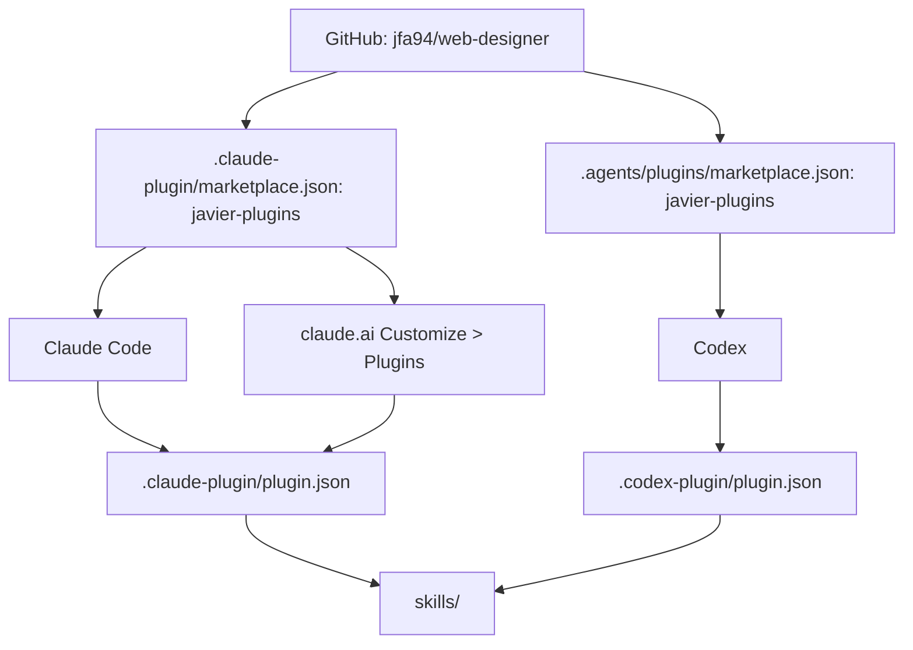

# Deployment

The plugin is distributed straight from its GitHub repository, `jfa94/web-designer`. There is no build or packaging step: each runtime reads the manifests and `skills/` from the repository.

## Distribution paths

| Runtime | Marketplace file | Plugin manifest | Skill discovery |
|---|---|---|---|
| Claude Code | `.claude-plugin/marketplace.json` (plugin source `./`) | `.claude-plugin/plugin.json` | The plugin's `skills/` directory |
| Codex | `.agents/plugins/marketplace.json` (local source, path `./`) | `.codex-plugin/plugin.json` | `"skills": "./skills/"` in the manifest |
| claude.ai | Marketplace `jfa94/web-designer`, added under Customize → Plugins (paid plans) | Not specified in this repository | Skills trigger when a request matches their description |

Both marketplaces are named `javier-plugins` and list one plugin, `web-designer`. Claude Code and Codex install it as `web-designer@javier-plugins`.

## Runtime surface

| Runtime | Explicit invocation | Automatic invocation |
|---|---|---|
| Claude Code | `/web-designer:<skill>` | When the request matches the skill description |
| Codex | `$web-designer:<skill>` | When the request matches the skill description |
| claude.ai | Not applicable | When the request matches the skill description |

Codex also reads the `interface` block in `.codex-plugin/plugin.json`: display name, descriptions, category, the declared capabilities (`Read`, `Write`), website, and three default prompts.

## Local and development loading

- Claude Code can load a checkout without installing it: `claude --plugin-dir /path/to/web-designer-plugin`.
- `claude plugin eval` loads the plugin from a path target and runs the suite in `evals/`. See [Run the eval suite](../guides/run-the-evals.md).

## Releases

The version is stored in three manifests, which must all agree. Version changes so far have been plain commits on `main`, and the repository has no Git tags. See [Change the plugin version](../guides/change-the-version.md).
