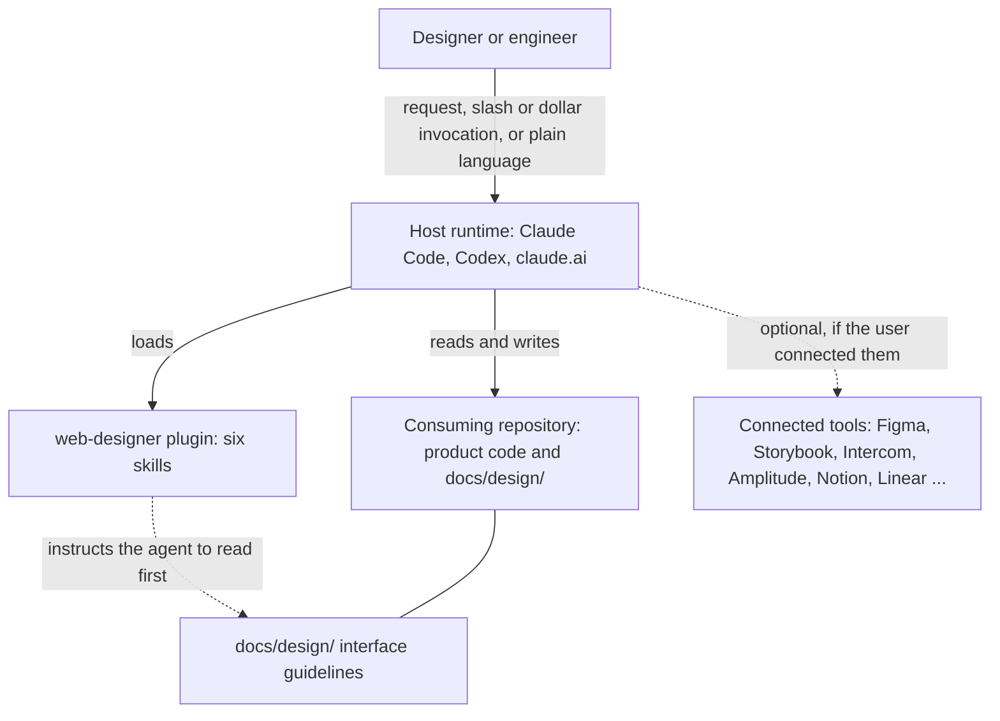
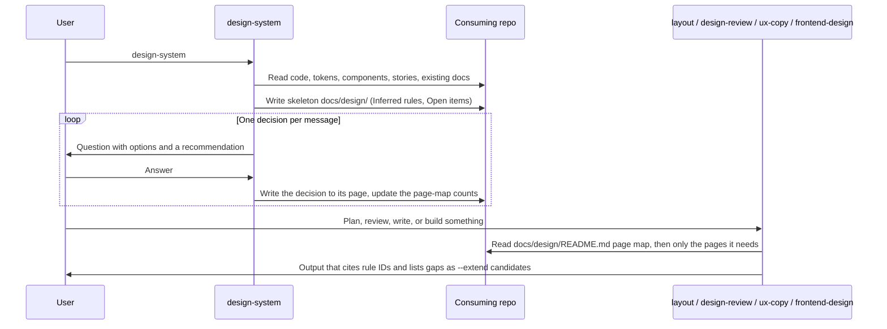

# Architecture Overview

## System context

Web Designer contains only skill content. A host runtime (Claude Code, Codex, or claude.ai) loads the skills, and the user's agent follows them while it works in the user's repository or conversation. The plugin runs no code of its own.

- **User**: invokes a skill explicitly (`/web-designer:<skill>` in Claude Code, `$web-designer:<skill>` in Codex) or lets the runtime pick one when the request matches a skill's description.
- **Host runtime**: discovers the skills from the plugin's `skills/` directory and runs the agent. Every file and tool access happens here, with the runtime's permissions.
- **Consuming repository**: the product the user is working on. `design-system` writes the product's interface guidelines there, by default under `docs/design/`. The other skills read them.
- **Connected tools**: the plugin bundles no MCP servers. A skill uses a connected design tool, component catalogue, feedback tool, analytics tool, knowledge base, or tracker when one is available and relevant. Every skill also works from files, URLs, screenshots, or text the user supplies.

## Containers

The repository has four parts:

| Container | Path | Role |
|---|---|---|
| Manifests | `.claude-plugin/`, `.codex-plugin/`, `.agents/plugins/` | Name, version, and describe the plugin, and declare the `javier-plugins` marketplace for each runtime |
| Skills | `skills/<name>/SKILL.md`, `skills/<name>/references/*.md` | The shipped product: six skills plus the reference files they load when needed |
| Structural check | `tests/plugin-compatibility.sh` | Checks that the manifests agree with each other, that skills meet the format rules, and that copied blocks stay identical |
| Eval suite | `evals/` | Behavioural cases run with `claude plugin eval` against a fixture product (Acme Admin) |

Only the manifests and `skills/` affect what users receive. The structural check and the eval suite are for development only.

## Main data flow: guidelines-first decisions

The skills connect through the guidelines, not by calling each other. `design-system` writes rules into the consuming repository. A later request to another skill reads those rules before it applies its own guidance.

A consuming skill resolves conflicts in this order: Requirements (Must / Must not), then Confirmed rules, then Inferred rules (followed but flagged as unconfirmed), then the skill's own guidance. A case covered by a live entry in the exceptions register is not a violation. See [Product guidelines model](../explanation/product-guidelines-model.md) for the reasoning behind this order.

## Further reading

- [Components](components.md): what each skill owns and which reference files it loads.
- [Deployment](deployment.md): how the plugin reaches each runtime.
